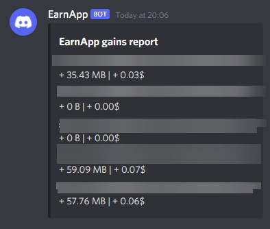

# EarnApp earnings watcher

[](https://www.npmjs.com/package/axios) [](https://www.npmjs.com/package/earnapp.js) [](https://www.npmjs.com/package/simple-discord-webhooks)

[](https://github.com/LockBlock-dev/earnapp-earnings-watcher/stargazers)

Send a report of your hourly earning in a channel via a Discord webhook

Bugs can occur, this is an unofficial use of the EarnApp API.



## Installation

-   Install [NodeJS](https://nodejs.org).
-   Download or clone the project.
-   Go to the `earnapp-earnings-watcher` folder and run `npm install`.
-   In the [config.js](./index.js), you need to edit 2 things:

```js
discordWebhookURL: "WEBHOOK URL", //Discord WebHook URL
authMethod: "google", //don't touch this one
oauthRefreshToken: "COOKIE", //see https://github.com/LockBlock-dev/earnapp.js#how-to-login-with-cookies
delay: 5, //delay in minutes between each check for an exact hour
```

-   Run `node index.js` or `npm start`.

## How does it work

The script checks each 5 minutes (by default) if it is an exact hour (17:00, 8:00, ...). Then it waits 30 seconds to allow all earnings to update. After that it gets your earnings with the provided cookie. Finally it calculates the difference between your previous balance and the new one and sends the results to the Discord WebHook.

This means the webhook message can be sent between XX:00:30 and XX:05:30, don't panic if you don't see any message in the first few minutes.

First start sends your whole balance, it's normal since the script doesn't have previous balance.

Devices that has 0 Byte of traffic aren't included in the report.

## Credits

[EarnApp](https://earnapp.com)

## Copyright

See the [license](/LICENSE)
